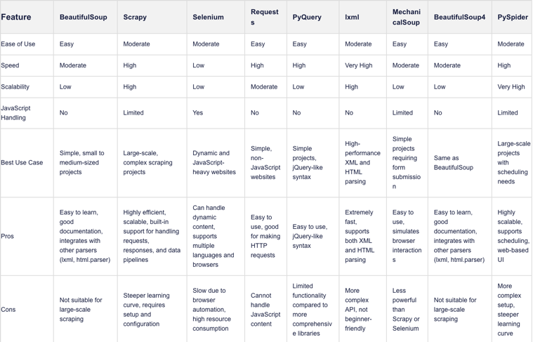

## Step-by-Step Webscraping process

### What is Webscraping Using Python Anyway?

Python web scraping is an automated method used for collecting large amounts of data from websites and storing it in a structured form.
Shown below is a table that depicts different libraries that can be used for scraping website data.



### Step 1: Choose the Website and Webpage URL

The first step is to select the website you want to scrape. For this particular tutorial, let’s scrape https://www.imdb.com/. We will try to extract data on the top-rated movies on the website.

### Step 2: Inspect the website

Now the next step is to understand the website structure. Understand what the attributes of the elements that are of your interest are. Right-click on the website to select “Inspect”. This will open the HTML code. Use the inspector tool to see the name of all the elements to use in the code.

### Step 3: Installing the important libraries

Shown below are just a few and most popular ones:
requests - for making HTTP requests to the website
BeautifulSoup - for parsing the HTML code
pandas - for storing the scraped data in a data frame
time - for adding a delay between requests to avoid overwhelming the website with requests

Install the libraries using the following command below:

``` 
pip install requests beautifulsoup4 pandas time
```

### Step 4: Write the Python code

Now, it’s time to write the main python code. The code will perform the following steps:

*Tips
Using requests to send an HTTP GET request
Using BeautifulSoup to parse the HTML code
Extracting the required data from the HTML code
Store the information in a pandas dataframe
Add a delay between requests to avoid overwhelming the website with requests

### Step 5: Exporting the extracted data

Now, let’s export the data as a CSV file. We will use the pandas library.

### Step 6: Verify the extracted data

Open the CSV file to verify that the data has been successfully scraped and stored.

### Parsing HTML Forms

o scrape HTML forms using Python, you can use a library such as BeautifulSoup, lxml, or mechanize. Here are the general steps:

Step 1: Send an HTTP request to the URL of the webpage with the form you want to scrape. The server responds to the request by returning the HTML content of the webpage.

Step 2: Once you have accessed the HTML content, you can use an HTML parser to locate the form you want to scrape. For example, you can use BeautifulSoup's find() method to locate the form tag.

Step 3: Once you have located the form, you can extract the input fields and their corresponding values using the HTML parser. For example, you can use BeautifulSoup's find_all() method to locate all input tags within the form, and then extract their name and value attributes.

Step 4: You can then use this data to submit the form or perform further data processing.

